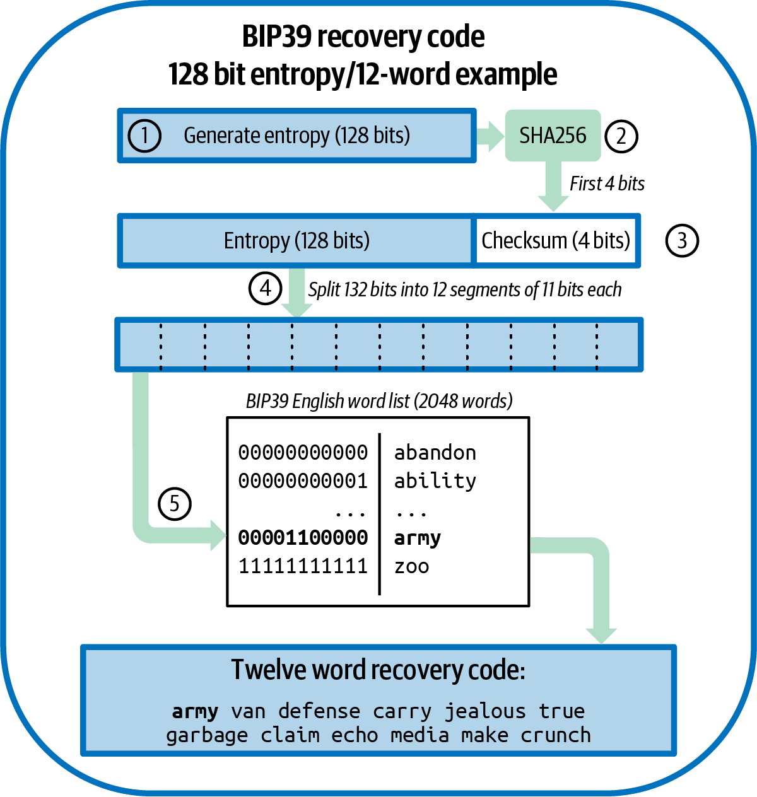
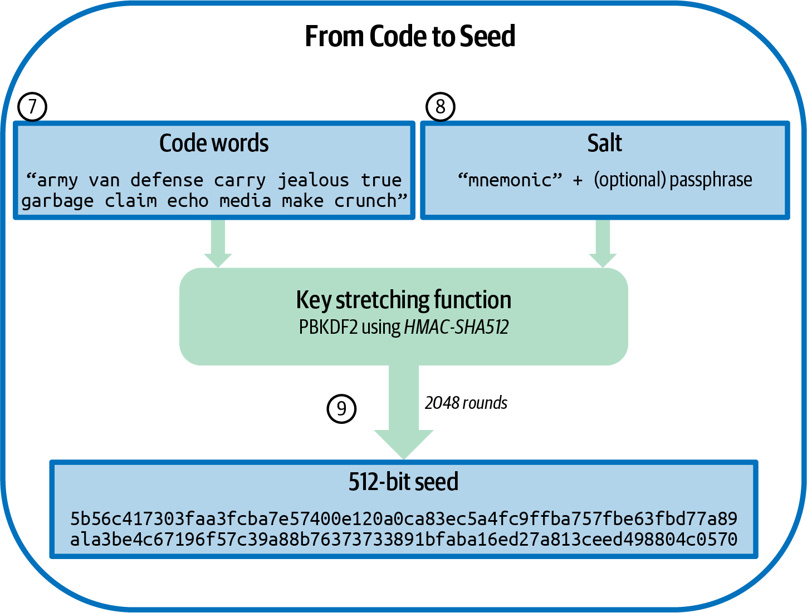
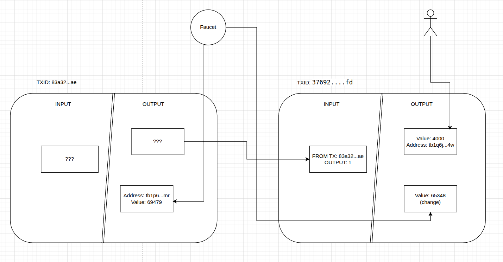

### bitcoin-testnet-wallet is a project created by reason to get practice on generating keys, creating addresses and transactions. 
There is only education content but structure and deployment practice closed to real project (for several exclusions)

# Progress

## Get bitcoins
### 1 Generate BIP39 seed from passphrase

*mnemonic(code words) can be constant. It will lead to the same seed




### 2 Create master private and public keys 
From seed create BIP32 private key

### 3 Generate bech32 address
By path m/84'/1'/0'/0/0 create bech32 address from m - master private key
Address must be passed through RIPEMD160(SHA256(address)) hashing and then compressed

### 4 Receive funds
For example for address: tb1qjerwcxd7ee2pmqeu8fhan6wlvqvvy802ljrx4w

Have the following transaction:
```json
{
    "txid": "37692a5d9245687d0c054972489adbeaf77f1d8e99bfe2a297ffac3a2aeb8bfd",
    "version": 2,
    "locktime": 4506577,
    "vin": [
        {
            "txid": "83a32cdb6a4a9140b2604d6042ba3c180e82ae69d6a54386ff2aa8941f5a15ae",
            "vout": 1,
            "prevout": {
                "scriptpubkey": "5120d3a66277ada623d94b9b9071d50b418e0934b1400c2fa72daec7d587234616a3",
                "scriptpubkey_asm": "OP_PUSHNUM_1 OP_PUSHBYTES_32 d3a66277ada623d94b9b9071d50b418e0934b1400c2fa72daec7d587234616a3",
                "scriptpubkey_type": "v1_p2tr",
                "scriptpubkey_address": "tb1p6wnxyaad5c3ajjumjpca2z6p3cynfv2qpsh6wtdwcl2cwg6xz63swyhwmr",
                "value": 69479
            },
            "scriptsig": "",
            "scriptsig_asm": "",
            "witness": [
                "3d7a41d422365c360761d360c9b1437a8a16154e444045d41d368edeed7693f040367c49a90a8c21a69f027e5a8f9c2882ff79eb098640dfdfb481fd56684676"
            ],
            "is_coinbase": false,
            "sequence": 4294967293
        }
    ],
    "vout": [
        {
            "scriptpubkey": "00149646ec19bece541d833c3a6fd9e9df6018c21dea",
            "scriptpubkey_asm": "OP_0 OP_PUSHBYTES_20 9646ec19bece541d833c3a6fd9e9df6018c21dea",
            "scriptpubkey_type": "v0_p2wpkh",
            "scriptpubkey_address": "tb1qjerwcxd7ee2pmqeu8fhan6wlvqvvy802ljrx4w",
            "value": 4000
        },
        {
            "scriptpubkey": "00141711c2090e9aba6bab42e91b4cd58b357649b06e",
            "scriptpubkey_asm": "OP_0 OP_PUSHBYTES_20 1711c2090e9aba6bab42e91b4cd58b357649b06e",
            "scriptpubkey_type": "v0_p2wpkh",
            "scriptpubkey_address": "tb1qzuguyzgwn2axh26zayd5e4vtx4mynvrwkzmt47",
            "value": 65348
        }
    ],
    "size": 181,
    "weight": 520,
    "fee": 131,
    "status": {
        "confirmed": true,
        "block_height": 4506578,
        "block_hash": "000000000000000b9ff0175f8d535ffcd308d13ef289b1fa99bcbe2994c40212",
        "block_time": 1749800356
    }
}
```




## Send bitcoins to faucet

https://blockstream.info/testnet/api/tx response with txID : 0de504af7fca326101e9aa959a2e3a0a0e84ab281ccbc019b15a580342b43f78

```json
{
    "txid": "0de504af7fca326101e9aa959a2e3a0a0e84ab281ccbc019b15a580342b43f78",
    "version": 1,
    "locktime": 0,
    "vin": [
        {
            "txid": "37692a5d9245687d0c054972489adbeaf77f1d8e99bfe2a297ffac3a2aeb8bfd",
            "vout": 0,
            "prevout": {
                "scriptpubkey": "00149646ec19bece541d833c3a6fd9e9df6018c21dea",
                "scriptpubkey_asm": "OP_0 OP_PUSHBYTES_20 9646ec19bece541d833c3a6fd9e9df6018c21dea",
                "scriptpubkey_type": "v0_p2wpkh",
                "scriptpubkey_address": "tb1qjerwcxd7ee2pmqeu8fhan6wlvqvvy802ljrx4w",
                "value": 4000
            },
            "scriptsig": "",
            "scriptsig_asm": "",
            "witness": [
                "3044022058c4be728258af7bdbb55a0d7bdb7a2ea61d66eadee8ed07e0e49ec02d575d83022024c0ab28d8ba35fc430f611851f8a27e01122f8166541f975978a515a7b8e5b101",
                "025017df04354e9a9d8345661774bd15ca04c75ac633dc576e660dc314f86df805"
            ],
            "is_coinbase": false,
            "sequence": 4294967295
        }
    ],
    "vout": [
        {
            "scriptpubkey": "0014fcb55e6920e2c6f37327a5bf4a24cf42ebbaf07c",
            "scriptpubkey_asm": "OP_0 OP_PUSHBYTES_20 fcb55e6920e2c6f37327a5bf4a24cf42ebbaf07c",
            "scriptpubkey_type": "v0_p2wpkh",
            "scriptpubkey_address": "tb1qlj64u6fqutr0xue85kl55fx0gt4m4urun25p7q",
            "value": 3782
        }
    ],
    "size": 191,
    "weight": 437,
    "fee": 218,
    "status": {
        "confirmed": true,
        "block_height": 4506716,
        "block_hash": "000000000942fa42e4eb950eb43bdb6bc39d186de144d6c1685fb32e299f1561",
        "block_time": 1749829244
    }
}
```
