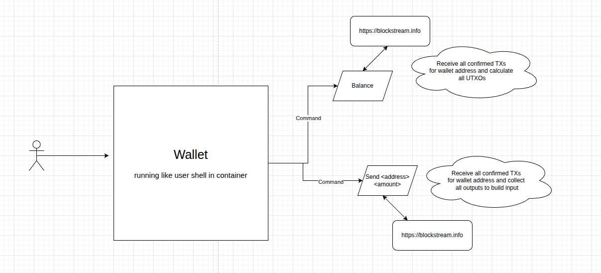
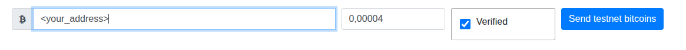

### bitcoin-testnet-wallet is a project created by reason to get practice on generating keys, creating addresses and transactions. 
*There is only education content but structure and deployment practice closed to real project (for several exclusions)*

The main idea is create own bitcoin wallet to receiving/sending funds from/to the bitcoin testnet faucet

### Functional scheme


# Usage
1. ## Create file by path config/config.yaml and put the following:
```yaml
secretPassphrase: "The Spanish guy who lost his car - Carlos"
uniqueSeed: false
```
### *It's necessary to change secretPassphrase in config/config.yaml with your phrase*

2. ## Start wallet by following commands:
```bash
make build
make run
```

3. ## Input command in running wallet:
```bash
wallsh> wallet address
```
*It's your bitcoin address*

4. ## Chose one of bitcoin testnet faucet:
- https://bitcoinfaucet.uo1.net (more reliable and clearly)
- https://cryptopump.info/send.php

5. ## Make sure that your available balance equal zero:
```bash
wallsh> wallet balance
```

6. ## Put your bitcoin address into faucet and click "Send":


7. ## After few seconds check your "On hold" balance
You can see that your hold balance isn't equal zero. It points on that your transaction is already in mempool.

8. ## After few minutes check your "Available" balance again
If it isn't equal zero, successful, you have received your first bitcoins

9. ## To return some bitcoins back to faucet use command:
```bash
wallsh> wallet send <faucet_address> <amount>
```
For the https://bitcoinfaucet.uo1.net faucet address is published on main page: 


### After sending you can also check your wallet balance for understanding moving your funds