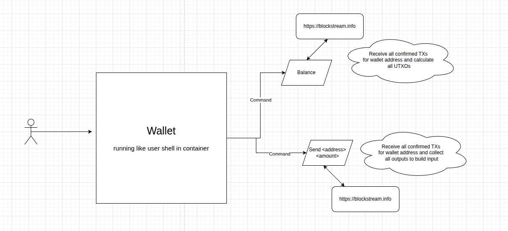

### bitcoin-testnet-wallet is a project created by reason to get practice on generating keys, creating addresses and transactions. 
*There is only education content but structure and deployment practice closed to real project (for several exclusions)*

The main idea is create own bitcoin wallet to receiving/sending funds from/to the bitcoin testnet faucet

### Functional scheme

## Functional TODO
1. For every transaction use different wallet address
    - m/84'/1'/0'/0/n (external address for receive funds)
    - m/84'/1'/0'/1/n (internal address for changes)
2. Backup functionality to wallet (need additional research). Save only:
    - recovery codes ~ mnemonic;
    - passphrase;
    - n.
3. Support also mainnet (need additional research)